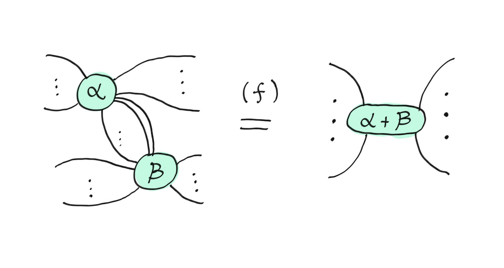
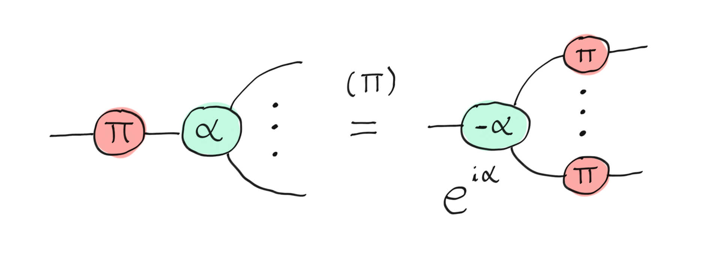
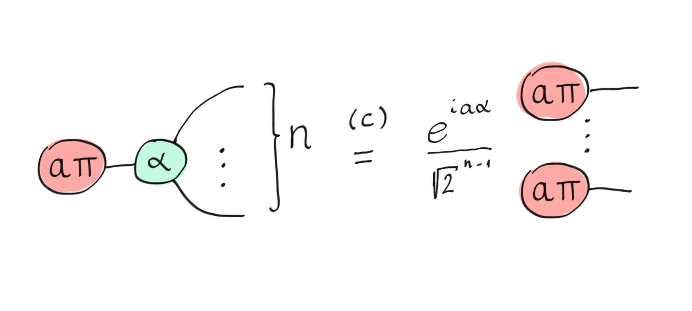
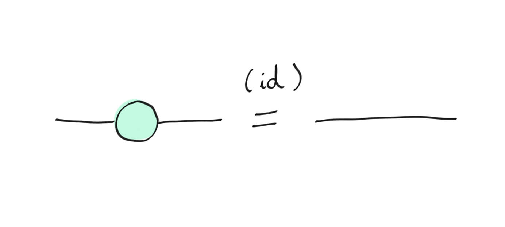
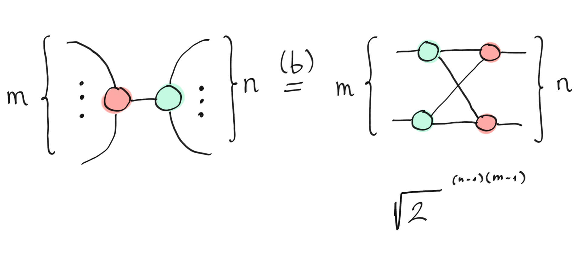
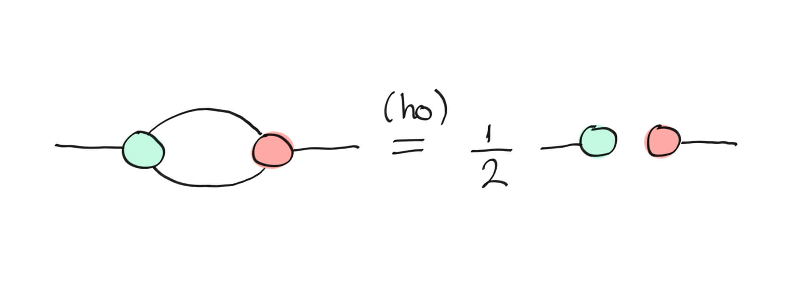

# Queries

The ZX-calculus rules have two alternatives for implementation.
They are either implemented via PyZX, where for each operation done by PyZX, there are corresponding DB operations to achieve the same thing.
The other option are rewriting the ZX calculus rules, to perform an action in the DB with fewer DB transactions/queries.

As this is pretty slow and inefficient, another alternative is rewriting some of the queries.
These rewrites are located in file `graph/zxdb/query_collections/main_queries.json`

A lot of this section is paraphrased from Romain Moyard's [article](https://pennylane.ai/qml/demos/tutorial_zx_calculus), published on Pennylane in 2023.
The images in this section are also from Romain Moyard's article.

Table overview of all query rewrites

| Query  | Status | Location |
|--------|--------|----------|
| I/O node Hadamard wires -> wires with Hadamard gates | TBD | `collection-circuit-extraction.json` |
| Find frontier | TBD | `collection-circuit-extraction.json` |
| Frontier nodes with degree two | TBD | `collection-circuit-extraction.json` |
| Pull CZ gates through | TBD | `collection-circuit-extraction.json` |
| Hadamard cancellation labeling query | TBD | `collection-Labeling-queries-ZXdb.json` |
| Spider labeling query green | TBD | `collection-Labeling-queries-ZXdb.json` |
| Spider labeling query red | TBD | `collection-Labeling-queries-ZXdb.json` |
| Spider labeling query green and red | TBD | `collection-Labeling-queries-ZXdb.json` |
| Local complement labeling | TBD | `collection-Labeling-queries-ZXdb.json` |
| Bialgebra labeling | TBD | `collection-Labeling-queries-ZXdb.json` |
| Spider labeling query green 2 | TBD | `collection-Labeling-queries-ZXdb.json` |
| Spider labeling query | TBD | `collection-Labeling-queries-ZXdb.json` |
| Hadamard edge cancellation | TBD | `collection-Rewrite-queries-ZXdb.json` |
| Spider fusion rewrite | TBD | `collection-Rewrite-queries-ZXdb.json` |
| Pivot rule - two interior Pauli spiders | TBD | `collection-Rewrite-queries-ZXdb.json` |
| Pivot rule - single interior Pauli spider | TBD | `collection-Rewrite-queries-ZXdb.json` |
| Local complement rewrite | TBD | `collection-Rewrite-queries-ZXdb.json` |
| Gadget fusion red green | TBD | `collection-Rewrite-queries-ZXdb.json` |
| Gadget fusion Hadamard | TBD | `collection-Rewrite-queries-ZXdb.json` |
| Pivot gadget | TBD | `collection-Rewrite-queries-ZXdb.json` |
| Pivot boundary | TBD | `collection-Rewrite-queries-ZXdb.json` |
| Bialgebra red-green | TBD | `collection-Rewrite-queries-ZXdb.json` |
| Bialgebra Hadamard | TBD | `collection-Rewrite-queries-ZXdb.json` |
| Bialgebra simplification | TBD | `collection-Rewrite-queries-ZXdb.json` |
| Local complement full | TBD | `collection-Rewrite-queries-ZXdb.json` |
| Gadget fusion both | TBD | `collection-Rewrite-queries-ZXdb.json` |
| Spider fusion rewrite 2 | TBD | `collection-Rewrite-queries-ZXdb.json` |
| Spider fusion | TBD | `main_queries.json` |
| Hopf | TBD | `main_queries.json` |
| Remove identities with refactor | TBD | `main_queries.json` |
| Local complement | TBD | `main_queries.json` |
| Gadget fusion | TBD | `main_queries.json` |
| Get degree distribution | TBD | `main_queries.json` |
| Self loop query | TBD | `main_queries.json` |
| Remove isolated vertices | TBD | `main_queries.json` |
| Supplementarity simp 1 | TBD | `main_queries.json` |
| Supplementarity simp 2 | TBD | `main_queries.json` |
| Remove identities | TBD | `memgraph-collection-zxdb.json` |
| Bialgebra | TBD | `memgraph-collection-zxdb.json` |
| Unfuse | TBD | `memgraph-collection-zxdb.json` |
| Pi commutation - one node | TBD | `memgraph-collection-zxdb.json` |
| State copy | TBD | `memgraph-collection-zxdb.json` |
| Change color | TBD | `memgraph-collection-zxdb.json` |
| Turn Hadamard edges into Hadamard boxes | TBD | `memgraph-collection-zxdb.json` |
| Turn Hadamard gates into Hadamard edges | TBD | `memgraph-collection-zxdb.json` |
| Return all | TBD | `memgraph-collection-zxdb.json` |
| Cancel Hadamard patterns | TBD | `memgraph-collection-zxdb.json` |
| Hopf rule | TBD | `memgraph-collection-zxdb.json` |
| Remove extra edges | TBD | `memgraph-collection-zxdb.json` |
| Bipartite cliques | TBD | `memgraph-collection-zxdb.json` |
| Remove identities 2 | TBD | `memgraph-collection-zxdb.json` |
| Change color age - mark | Working | `age-specific-queries.json` |
| Change color age - recolor | Working | `age-specific-queries.json` |
| Change color age - toggle wires | Working | `age-specific-queries.json` |
| Change color age - cleanup | Working | `age-specific-queries.json` |
| Spider fusion age | Mostly working | `age-specific-queries.json` |
| Spider fusion age reverse | Mostly working | `age-specific-queries.json` |
| Spider fusion age - normalize | Mostly working | `age-specific-queries.json` |
| Spider fusion age - self loops | Mostly working | `age-specific-queries.json` |
| Spider fusion age - cleanup merged mark | Mostly working | `age-specific-queries.json` |
| Local complementation age | Not working | `age-specific-queries.json` |
| Local complementation age - batch process pairs | Not working | `age-specific-queries.json` |
| Local complementation age - delete hadamard edges | Not working | `age-specific-queries.json` |
| Local complementation age - toggle mixed edges | Not working | `age-specific-queries.json` |
| Local complementation age - batch apply center phase | Not working | `age-specific-queries.json` |
| Remove isolated vertices age | Working | `age-specific-queries.json` |
| Remove dangling pairs age | Working | `age-specific-queries.json` |
| Turn Hadamard gates into edges age | Working | `age-specific-queries.json` |
| Pivot rule age - find candidate | Scaffold | `age-specific-queries.json` |
| Pivot rule age - apply rewrite | Scaffold / TODO | `age-specific-queries.json` |
| Spider fusion (A) | TBD | `main_queries.json` |
| Hopf (A) | TBD | `main_queries.json` |
| Bialgebra labeling (A) | TBD | `main_queries.json` |
| Bialgebra simplification (A) | TBD | `main_queries.json` |
| Hadamard cancellation labeling query (A) | TBD | `main_queries.json` |
| Hadamard edge cancellation (A) | TBD | `main_queries.json` |
| Remove identities with refactor (A) | TBD | `main_queries.json` |
| Local complement (A) | TBD | `main_queries.json` |
| Gadget fusion (A) | TBD | `main_queries.json` |
| Pivot boundary (A) | TBD | `main_queries.json` |
| Pivot gadget (A) | TBD | `main_queries.json` |
| Pivot rule - two interior Pauli spiders (A) | TBD | `main_queries.json` |
| Pivot rule - single interior Pauli spider (A) | TBD | `main_queries.json` |
| Get degree distribution (A) | TBD | `main_queries.json` |
| Remove identities (A/M) | TBD | `memgraph-collection-zxdb-age.json` |
| Bialgebra (A/M) | TBD | `memgraph-collection-zxdb-age.json` |
| Unfuse (A/M) | TBD | `memgraph-collection-zxdb-age.json` |
| Pi commutation - one node (A/M) | TBD | `memgraph-collection-zxdb-age.json` |
| State copy (A/M) | TBD | `memgraph-collection-zxdb-age.json` |
| Change color (A/M) | TBD | `memgraph-collection-zxdb-age.json` |
| Hadamard edges -> Hadamard boxes (A/M) | TBD | `memgraph-collection-zxdb-age.json` |
| Hadamard gates -> Hadamard edges (A/M) | TBD | `memgraph-collection-zxdb-age.json` |
| Return all (A/M) | TBD | `memgraph-collection-zxdb-age.json` |
| Cancel Hadamard patterns (A/M) | TBD | `memgraph-collection-zxdb-age.json` |
| Hopf rule (A/M) | TBD | `memgraph-collection-zxdb-age.json` |
| Remove extra edges (A/M) | TBD | `memgraph-collection-zxdb-age.json` |
| Get degree distribution (A/M) | TBD | `memgraph-collection-zxdb-age.json` |
| Bipartite cliques (A/M) | TBD | `memgraph-collection-zxdb-age.json` |
| Remove identities 2 (A/M) | TBD | `memgraph-collection-zxdb-age.json` |
| Remove identities with refactor (A/M) | TBD | `memgraph-collection-zxdb-age.json` |

 

## ZX calculus rules:

As the X-gate and Z-gate are not commutative, vertices without a phase that have a different color, do not commute.
Commutatitivity is a property of an operation, where changing the order of the operands does not affect the result, like $5 + 2 = 2 + 5$, but $\frac{2}{5} \neq \frac{5}{2}$.

-----

1. Fuse rule

    

    The fuse rule can be applied when two spiders of the same type are connected by one or more wires. 
    The resulting fused part of the graph is a spider with the phase as the sum of the phases of the two spiders.

    The rewrite for this rule is implemented by:

    "Spider fusion rewrite", "gadget fusion red green", "gadget fusion hadamard", "gadget fusion both"

    ---

2. π-copy rule

    

    The π-copy rule allows one to "pull through" an X-gate through a Z-spider (or Z-gate through an X-spider).
    Due to X and Z being anticommutative, the phase of the Z-gate becomes negative.

    This rule is implemented by:

    "Pi commutation - one node"

    ---

3. State-copy rule

    

    The state-copy rule tells us how simple, one-qubit states interact with a spider of the opposite colour.
    As it is only valid for states that are multiples of π.
    In this diagram, $a \in \mathbb{Z}$.
    This can be summarised as if you pull a basis state through an opposite colour spider, the basis state will be copied to each outgoing wire.

    This rule is implemented by:

    "State copy"

    ---

4. Identity rule

    

    According to the identity rule, if there is a spider that is: 

    A) phaseless and 

    B) has one input and one output, 

    it is equivalent to an identity and can be removed.
    Thanks to this rule, we can get rid of self-loops.

    This rule is implemented by:

    "Remove identities", "Remove identities 2", "Remove identities with refactor"

    ---

5. Bialgebra Rule

    

    A bialgebra is a structure where we have one product (combines two wires to one) and one coproduct (split a wire to two wires).
    For a bialgebra, we can pull a product through a coproduct, at the cost of doubling.

    This rule is implemented by:

    "Bialgebra"

    ---

6. Hopf rule

    

    The Hopf rule reminds of the bialgebra rule: it is in some sense the opposite of the bialgebra rule.
    In it we pull a coproduct through a product, but instead of doubling, this time, the wires decouple.
    This rule follows from the bialgebra and state-copy rules, but it is often documented as its own rule.

    This rule is implemented by:

    "Hopf", "Hopf rule"

    ---

**Auxiliary queries:**

There are some queries outside the ZX calculus rules.
Most often these exist for computational reasons, like combining two queries that are very often used after another in a sequence.

These queries are in the JSON listed as

- Unfuse
- change color
- Turn Hadamard edges into Hadamard boxes
- Turn Hadamard gates into Hadamard edges
- Return all
- Cancel Hadamard patterns
- Remove extra edges
- Get degree distribution
- Bipartite cliques
